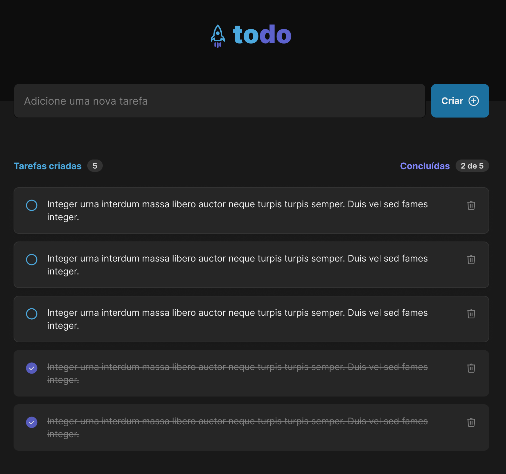

  
</>

  <a href="#-tecnologias">Tecnologias</a>&nbsp;&nbsp;&nbsp;|&nbsp;&nbsp;&nbsp;
  <a href="#-projeto">Projeto</a>&nbsp;&nbsp;&nbsp;|&nbsp;&nbsp;&nbsp;
  <a href="#-conceitos">Conceitos</a>&nbsp;&nbsp;&nbsp;|&nbsp;&nbsp;&nbsp;
  <a href="#-layout">Layout</a>

<h3 style="color:#5E60CE; text-align:center;">Tecnologias</h3>

  
  
  

 
<h1>💻 Projeto</h1>

Desenvolver uma aplicação de controle de tarefas no estilo **to-do list**, que contém as seguintes funcionalidades:
- Adicionar uma nova tarefa
- Marcar e desmarcar uma tarefa como concluída
- Remover uma tarefa da listagem
- Mostrar o progresso de conclusão das tarefas

<h4>📝 Conceitos</h4>

- Estados
- Imutabilidade do estado
- Listas e chaves no ReactJS
- Propriedades
- Componentização

<h1>🎨 Layout</h1>

  

---
Feito com 🧡 by Taiane Karine.